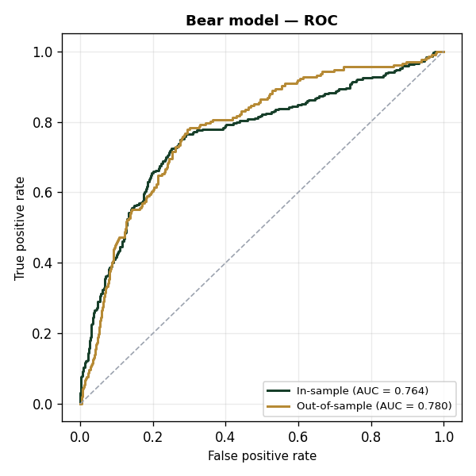
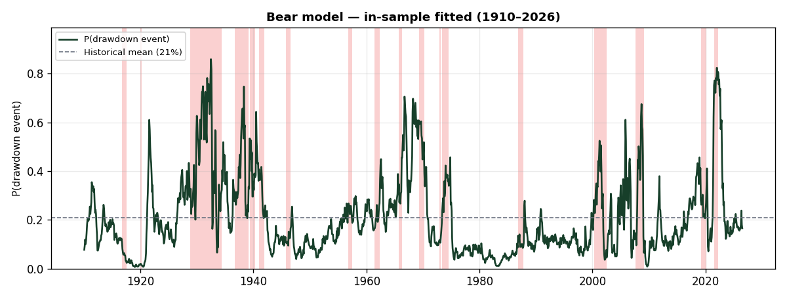
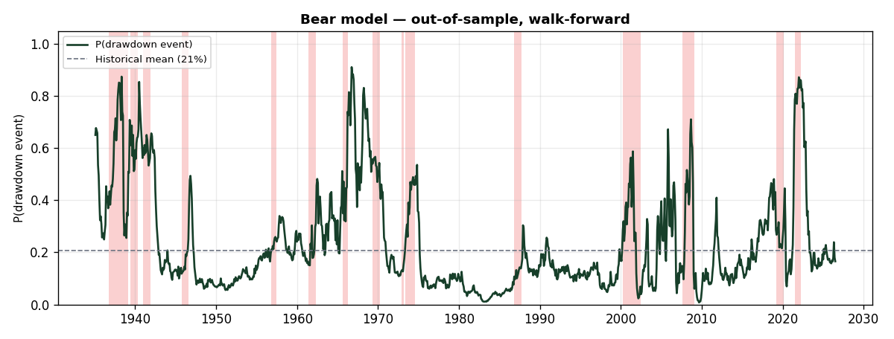

# Bear Model — Technical Documentation

*Generated from `bear/bear_features.csv` and `bear/targets.csv`. Reproduce with `python -m bear.make_docs`.*

## 1. Overview

- **Objective:** estimate a binary **12-month rolling correction**, $y_t = \mathbf{1}\{\mathrm{MDD}_t \le -10\%\}$, i.e. any drawdown deeper than 10% over the rolling 12-month forward window.
- **Model:** weight-constrained binary logistic on standardized factors, signs fixed to economic priors, calibrated to the base rate.
- **Horizon:** 12 months (rolling forward window).
- **Sample:** 1910-01-31 → 2026-06-30 (1397 complete monthly observations).
- **Historical base rate:** 20.8%.
- **Current reading (2026-06-30):** P(event) = **16.6%**.
- **Inference:** Newey-West HAC, max lag = 12 months.

## 2. Feature Engineering

All raw series are monthly (daily/weekly series are sampled to month-end), shifted forward by their real-world publication lag to prevent look-ahead, and transformed to stationary form. Each factor is then standardized on the training sample, $\tilde{x}_{i,t} = (x_{i,t}-\mu_i)/\sigma_i$.

| # | Factor | Raw series | Transformation | Rationale |
|---|---|---|---|---|
| 1 | `infl_zscore_120m` | — | — | — |
| 2 | `infl_yoy` | — | — | — |
| 3 | `spx_vs_10ma` | S&P 500 price (monthly close) | % deviation from 10-month MA (≈ 200-day) | Trend deterioration; price below the long MA is risk-off (Moskowitz-Ooi-Pedersen 2012). |
| 4 | `cape_z_120m` | — | — | — |

Forward drawdown target (rolling window):

$$\mathrm{MDD}_t = \min_{t < u \le t+12}\left(\frac{P_u}{\max_{t<v\le u}P_v}-1\right)$$

## 3. Constrained Logistic Model

**Link / specification:**

$$\hat{p}_t = \Pr(y_t=1) = \sigma(z_t) = \frac{1}{1+e^{-z_t}}$$

$$z_t = \beta_0 + \sum_{i=1}^{4} \beta_i\,\tilde{x}_{i,t}$$

**Estimation:** coefficients are written as $\beta_i = \mathrm{sign}_i \cdot \gamma_i$ with $\gamma_i \ge 0$ (signs fixed to economic priors), fitted by maximizing the Bernoulli likelihood subject to per-factor weight bounds:

$$w_i = \frac{|\beta_i|}{\sum_j |\beta_j|}, \qquad 0\% \le w_i \le 100\%$$

**Fitted model:**

$$z_t = -1.625 +1.139\,\tilde{x}_{1} -1.195\,\tilde{x}_{2} -0.480\,\tilde{x}_{3} +0.378\,\tilde{x}_{4}$$

**Fitted coefficients** (sorted by weight):

| Factor | Coefficient $\beta_i$ | Weight $w_i$ | p (HAC) |
|---|---:|---:|---:|
| `infl_yoy` | -1.1947 | 37.4% | 0.002 \* |
| `infl_zscore_120m` | +1.1392 | 35.7% | 0.000 \* |
| `spx_vs_10ma` | -0.4801 | 15.0% | 0.016 \* |
| `cape_z_120m` | +0.3775 | 11.8% | 0.114 |
| _intercept_ | -1.6255 | — | — |

`*` p<0.05  ·  `.` p<0.10  (Newey-West HAC, max lag = 12).

## 4. Regression Performance

### 4.1 Specification

- **Form:** binary logistic, identity-of-weights constraint $w_i \in [0\%, 100\%]$, 4 factors, signs fixed.
- **Autocorrelation:** the 12-month rolling target overlaps across consecutive months (consecutive observations share 11/12 of their window). Standard errors are Newey-West **HAC**-corrected with a Bartlett kernel and max lag = 12 months.
- **Calibration:** fitted by natural-weight likelihood, so the output is calibrated to the 20.8% base rate.

### 4.2 Sensitivity

Marginal effect of a **+1 standard-deviation** move in each factor on the model output, evaluated at the current reading ($\partial \hat{y} = \hat{y}(1-\hat{y})\,\beta_i$, $\hat{y}=0.166$):

| Factor | $\beta_i$ | Weight | Δ output / +1 SD | p (HAC) | Push |
|---|---:|---:|---:|---:|---|
| CPI inflation, YoY % | -1.1947 | 37.4% | -0.1650 (-16.50 pp) | 0.002 | Bullish |
| CPI inflation, 10yr z-score | +1.1392 | 35.7% | +0.1574 (+15.74 pp) | 0.000 | Bearish |
| S&P 500 vs 10-month MA | -0.4801 | 15.0% | -0.0663 (-6.63 pp) | 0.016 | Bullish |
| Shiller CAPE, 10yr z-score | +0.3775 | 11.8% | +0.0522 (+5.22 pp) | 0.114 | Bearish |

### 4.3 Area Under the Curve (AUC)

Discrimination is measured against the realized event (*Bear event: 12-month drawdown > 20%*); the predicted probability is the ranking score.

| Sample | AUC | N | Events |
|---|---:|---:|---:|
| In-sample | 0.764 | 1397 | 290 |
| Out-of-sample (walk-forward) | 0.780 | 1097 | 207 |

## 5. Charts

### 5.1 In-sample fit

Fitted values across the full sample (parameters estimated on the full sample). Shaded spans mark the realized rolling-window event.

### 5.2 Out-of-sample (walk-forward)

Expanding-window estimate: at each month the model is re-fit on prior data only, then predicts that month (no look-ahead).

## 6. Appendix — Realized Bear Events

The 290 event-months in the AUC sample (signal months whose 12-month forward drawdown exceeded 20%) group into **19 distinct episodes**. *Start*/*End* are the first and last signal months of each run; *Worst drawdown* is the deepest 12-month forward drawdown observed during the episode.

| # | Start | End | Signal months | Worst drawdown |
|---|---|---|---:|---:|
| 1 | 1916-09 | 1917-07 | 11 | -28.9% |
| 2 | 1919-12 | 1920-03 | 4 | -22.9% |
| 3 | 1928-10 | 1934-05 | 68 | -71.2% |
| 4 | 1936-09 | 1939-02 | 30 | -52.0% |
| 5 | 1939-05 | 1940-04 | 12 | -31.9% |
| 6 | 1940-12 | 1941-11 | 12 | -28.7% |
| 7 | 1945-09 | 1946-07 | 11 | -27.7% |
| 8 | 1956-10 | 1957-06 | 9 | -20.7% |
| 9 | 1961-05 | 1962-04 | 12 | -28.0% |
| 10 | 1965-08 | 1966-03 | 8 | -22.2% |
| 11 | 1969-04 | 1970-03 | 12 | -32.7% |
| 12 | 1972-11 | 1973-02 | 4 | -23.4% |
| 13 | 1973-05 | 1974-07 | 15 | -43.0% |
| 14 | 1981-03 | 1981-03 | 1 | -21.4% |
| 15 | 1986-10 | 1987-09 | 12 | -33.5% |
| 16 | 2000-03 | 2002-06 | 28 | -34.7% |
| 17 | 2007-07 | 2009-01 | 19 | -52.6% |
| 18 | 2019-03 | 2020-02 | 12 | -33.9% |
| 19 | 2021-06 | 2022-03 | 10 | -25.4% |
| | | **Total** | **290** | |
