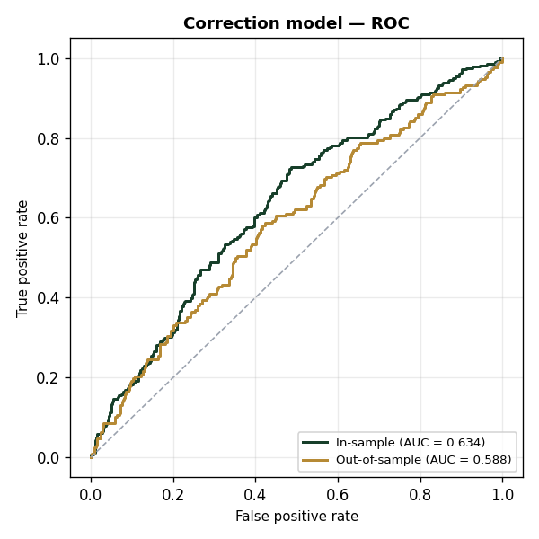
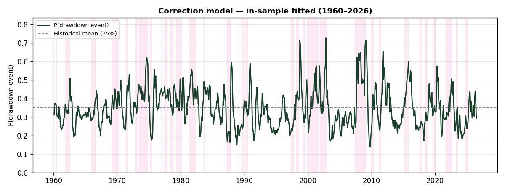
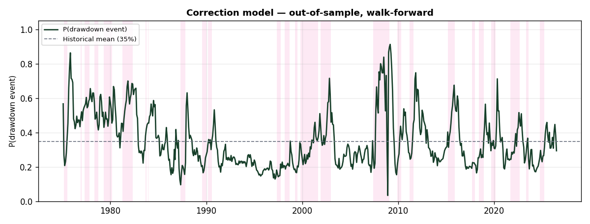

# Correction Model — Technical Documentation

*Generated from `bear/correction_features.csv` and `bear/targets.csv`. Reproduce with `python -m bear.make_docs`.*

## 1. Overview

- **Objective:** estimate a binary **6-month rolling correction**, $y_t = \mathbf{1}\{\mathrm{MDD}_t \le -10\%\}$, i.e. any drawdown deeper than 10% over the rolling 6-month forward window.
- **Model:** weight-constrained binary logistic on standardized factors, signs fixed to economic priors, calibrated to the base rate.
- **Horizon:** 6 months (rolling forward window).
- **Sample:** 1960-01-31 → 2026-06-30 (797 complete monthly observations).
- **Historical base rate:** 34.9%.
- **Current reading (2026-06-30):** P(event) = **29.4%**.
- **Inference:** Newey-West HAC, max lag = 6 months.

## 2. Feature Engineering

All raw series are monthly (daily/weekly series are sampled to month-end), shifted forward by their real-world publication lag to prevent look-ahead, and transformed to stationary form. Each factor is then standardized on the training sample, $\tilde{x}_{i,t} = (x_{i,t}-\mu_i)/\sigma_i$.

| # | Factor | Raw series | Transformation | Rationale |
|---|---|---|---|---|
| 1 | `vts_slope` | VIX term structure (VIX3M − VIX) | Level (slope) | Steep contango = complacency that often precedes corrections; backwardation = stress. |
| 2 | `spx_vs_10ma` | S&P 500 price (monthly close) | % deviation from 10-month MA (≈ 200-day) | Trend deterioration; price below the long MA is risk-off (Moskowitz-Ooi-Pedersen 2012). |
| 3 | `m12_1_mom` | S&P 500 price (monthly close) | 12-1 momentum (12m return excluding last month) | Stretched momentum raises mean-reversion correction risk. |
| 4 | `anfci_3m_chg` | Chicago Fed Adjusted NFCI (FRED ANFCI) | 3-month change | Tightening financial conditions (orthogonalized to the economy) precede pullbacks. |
| 5 | `cape_20yr_pct` | Shiller CAPE (P/E10) | 20-year trailing percentile | Valuation extreme — a severity conditioner; weak standalone timer (Goyal-Welch 2008). |
| 6 | `baa_zscore_24m` | Moody's BAA − 10y default spread (FRED BAA10Y) | 24-month trailing z-score | Fast credit-stress signal (the Tokic-Jackson correction→bear bridge). |

Forward drawdown target (rolling window):

$$\mathrm{MDD}_t = \min_{t < u \le t+6}\left(\frac{P_u}{\max_{t<v\le u}P_v}-1\right)$$

## 3. Constrained Logistic Model

**Link / specification:**

$$\hat{p}_t = \Pr(y_t=1) = \sigma(z_t) = \frac{1}{1+e^{-z_t}}$$

$$z_t = \beta_0 + \sum_{i=1}^{6} \beta_i\,\tilde{x}_{i,t}$$

**Estimation:** coefficients are written as $\beta_i = \mathrm{sign}_i \cdot \gamma_i$ with $\gamma_i \ge 0$ (signs fixed to economic priors), fitted by maximizing the Bernoulli likelihood subject to per-factor weight bounds:

$$w_i = \frac{|\beta_i|}{\sum_j |\beta_j|}, \qquad 0\% \le w_i \le 30\%$$

**Fitted model:**

$$z_t = -0.653 +0.210\,\tilde{x}_{1} -0.418\,\tilde{x}_{2} +0.286\,\tilde{x}_{3} +0.074\,\tilde{x}_{4} -0.144\,\tilde{x}_{5} +0.373\,\tilde{x}_{6}$$

**Fitted coefficients** (sorted by weight):

| Factor | Coefficient $\beta_i$ | Weight $w_i$ | p (HAC) |
|---|---:|---:|---:|
| `spx_vs_10ma` | -0.4182 | 27.8% | 0.051 . |
| `baa_zscore_24m` | +0.3727 | 24.8% | 0.057 . |
| `m12_1_mom` | +0.2859 | 19.0% | 0.138 |
| `vts_slope` | +0.2095 | 13.9% | 0.360 |
| `cape_20yr_pct` | -0.1443 | 9.6% | 0.360 |
| `anfci_3m_chg` | +0.0742 | 4.9% | 0.541 |
| _intercept_ | -0.6529 | — | — |

`*` p<0.05  ·  `.` p<0.10  (Newey-West HAC, max lag = 6).

## 4. Regression Performance

### 4.1 Specification

- **Form:** binary logistic, identity-of-weights constraint $w_i \in [0\%, 30\%]$, 6 factors, signs fixed.
- **Autocorrelation:** the 6-month rolling target overlaps across consecutive months (consecutive observations share 5/6 of their window). Standard errors are Newey-West **HAC**-corrected with a Bartlett kernel and max lag = 6 months.
- **Calibration:** fitted by natural-weight likelihood, so the output is calibrated to the 34.9% base rate.

### 4.2 Sensitivity

Marginal effect of a **+1 standard-deviation** move in each factor on the model output, evaluated at the current reading ($\partial \hat{y} = \hat{y}(1-\hat{y})\,\beta_i$, $\hat{y}=0.294$):

| Factor | $\beta_i$ | Weight | Δ output / +1 SD | p (HAC) | Push |
|---|---:|---:|---:|---:|---|
| S&P 500 vs 10-month MA | -0.4182 | 27.8% | -0.0867 (-8.67 pp) | 0.051 | Bullish |
| BAA spread, 2yr z-score | +0.3727 | 24.8% | +0.0773 (+7.73 pp) | 0.057 | Bullish |
| 12-1 month price momentum | +0.2859 | 19.0% | +0.0593 (+5.93 pp) | 0.138 | Bearish |
| VIX term structure slope (VIX3M-VIX) | +0.2095 | 13.9% | +0.0434 (+4.34 pp) | 0.360 | Bearish |
| Shiller CAPE, 20yr percentile | -0.1443 | 9.6% | -0.0299 (-2.99 pp) | 0.360 | Bullish |
| Adj. financial conditions, 3m change | +0.0742 | 4.9% | +0.0154 (+1.54 pp) | 0.541 | Bearish |

### 4.3 Area Under the Curve (AUC)

Discrimination is measured against the realized event (*Correction event: 6-month drawdown > 10%*); the predicted probability is the ranking score.

| Sample | AUC | N | Events |
|---|---:|---:|---:|
| In-sample | 0.634 | 797 | 278 |
| Out-of-sample (walk-forward) | 0.588 | 617 | 208 |

## 5. Charts

### 5.1 In-sample fit

Fitted values across the full sample (parameters estimated on the full sample). Shaded spans mark the realized rolling-window event.

### 5.2 Out-of-sample (walk-forward)

Expanding-window estimate: at each month the model is re-fit on prior data only, then predicts that month (no look-ahead).

## 6. Appendix — Realized Correction Events

The 278 event-months in the AUC sample (signal months whose 6-month forward drawdown exceeded 10%) group into **35 distinct episodes**. *Start*/*End* are the first and last signal months of each run; *Worst drawdown* is the deepest 6-month forward drawdown observed during the episode.

| # | Start | End | Signal months | Worst drawdown |
|---|---|---|---:|---:|
| 1 | 1960-04 | 1960-07 | 4 | -10.1% |
| 2 | 1961-10 | 1962-07 | 10 | -26.4% |
| 3 | 1965-11 | 1966-07 | 9 | -19.5% |
| 4 | 1967-09 | 1967-09 | 1 | -10.0% |
| 5 | 1969-01 | 1970-04 | 16 | -25.9% |
| 6 | 1971-02 | 1971-03 | 2 | -10.7% |
| 7 | 1971-05 | 1971-08 | 4 | -11.0% |
| 8 | 1972-10 | 1973-03 | 6 | -15.0% |
| 9 | 1973-05 | 1974-10 | 18 | -33.1% |
| 10 | 1975-02 | 1975-06 | 5 | -14.1% |
| 11 | 1976-11 | 1976-12 | 2 | -10.4% |
| 12 | 1977-04 | 1977-10 | 7 | -11.2% |
| 13 | 1978-04 | 1978-09 | 6 | -13.6% |
| 14 | 1979-04 | 1980-02 | 11 | -17.1% |
| 15 | 1981-03 | 1982-04 | 14 | -17.4% |
| 16 | 1983-08 | 1983-09 | 2 | -10.6% |
| 17 | 1983-11 | 1983-12 | 2 | -12.0% |
| 18 | 1987-04 | 1987-10 | 7 | -33.5% |
| 19 | 1989-07 | 1989-12 | 6 | -10.2% |
| 20 | 1990-02 | 1990-07 | 6 | -19.9% |
| 21 | 1997-04 | 1997-09 | 6 | -10.8% |
| 22 | 1998-02 | 1998-08 | 7 | -19.3% |
| 23 | 1999-03 | 1999-06 | 4 | -12.1% |
| 24 | 1999-10 | 2001-08 | 23 | -26.4% |
| 25 | 2001-11 | 2002-12 | 14 | -31.8% |
| 26 | 2007-05 | 2009-01 | 21 | -46.4% |
| 27 | 2009-11 | 2010-04 | 6 | -16.0% |
| 28 | 2011-02 | 2011-07 | 6 | -19.2% |
| 29 | 2015-02 | 2015-11 | 10 | -13.3% |
| 30 | 2017-08 | 2017-12 | 5 | -10.2% |
| 31 | 2018-05 | 2018-11 | 7 | -19.8% |
| 32 | 2019-08 | 2020-02 | 7 | -33.9% |
| 33 | 2021-08 | 2022-08 | 13 | -23.6% |
| 34 | 2023-04 | 2023-07 | 4 | -10.3% |
| 35 | 2024-09 | 2025-03 | 7 | -18.9% |
| | | **Total** | **278** | |
